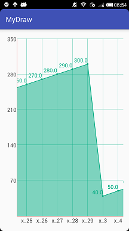

# HL.LineChart——自定义折线图


支持一条折线的情况，多条折现需要自己修改源码，效果图：<br/>


使用很方便,在布局文件中直接使用就可以：
```xml
    <com.helong.mydraw.LineChartView
        android:id="@+id/chart_view"
        android:layout_width="match_parent"
        android:layout_height="match_parent" />
```

在Activity中设置样式参数，这里只是部分参数，所有参数可以到LineParameters.java文件中查看：
```java
static final String FILL_COLOR = "#8000AB81";
static final String LINE_COLOR = "#00AB81";
static final String TEXT_COLOR = "#444444";
static final String AXES_COLOR = "#FF0000";
LineChartView lineChartView = (LineChartView) findViewById(R.id.chart_view);
lineChartView.getLineParameters()
    .setLineColor(Color.parseColor(LINE_COLOR))//设置折线的颜色
    .setyAxesColor(Color.parseColor(AXES_COLOR))//设置Y坐标轴的颜色
    .setyAxesTextColor(Color.parseColor(TEXT_COLOR))//设置Y坐标轴字体颜色
    .setyAxesTextSize(30)//设置Y坐标轴字体大小
    .setxAxesColor(Color.parseColor(AXES_COLOR))//设置X坐标轴颜色
    .setxAxesTextColor(Color.parseColor(TEXT_COLOR))//设置X坐标轴字体颜色
    .setxAxesTextSize(30)//设置X坐标轴字体大小
    .setFillColor(Color.parseColor(FILL_COLOR))//设置折线下方的填充色
    .setLineVaueTextSize(30);//设置折线上字体大小
```


设置要绘制的数据，数据类型为Map集合，因为项目中要根据数据的key排序，所以使用了TreeMap，
如果希望按照插入顺序则可以将TreeMap替换成LinkedHashMap即可。
```java
TreeMap<String, String> drawMap = new TreeMap<>();
for (int i = 0; i < 30; i++) {
    drawMap.put("x_" + i, String.valueOf(i * 10 + 10));
}
lineChartView.getLineParameters().setDrawMap(drawMap);//设置数据
lineChartView.refreshChartView();//刷新图表
```

嗯，就这样，如果数据比较多，可以横向滑动，图表会自动滑动到最右边
